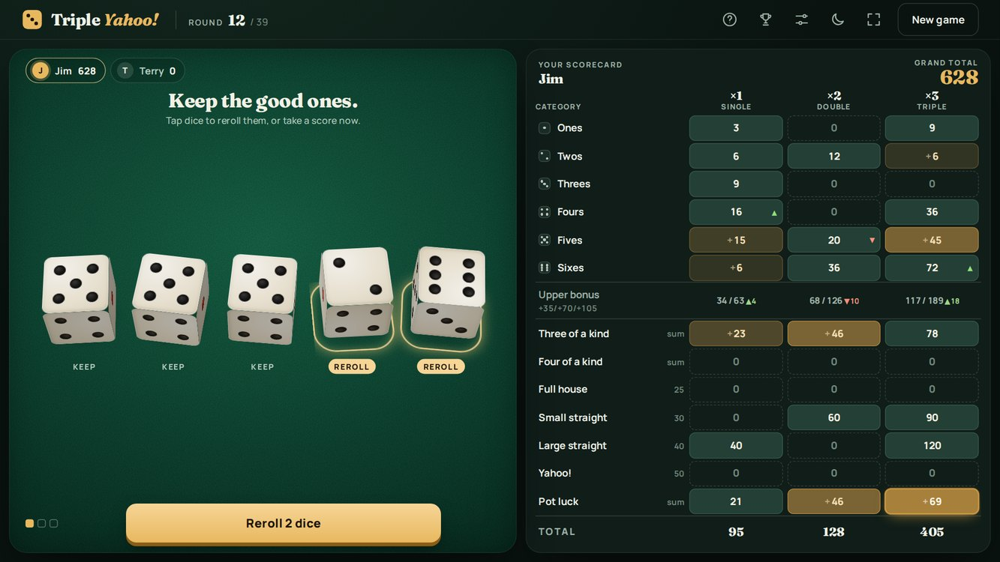
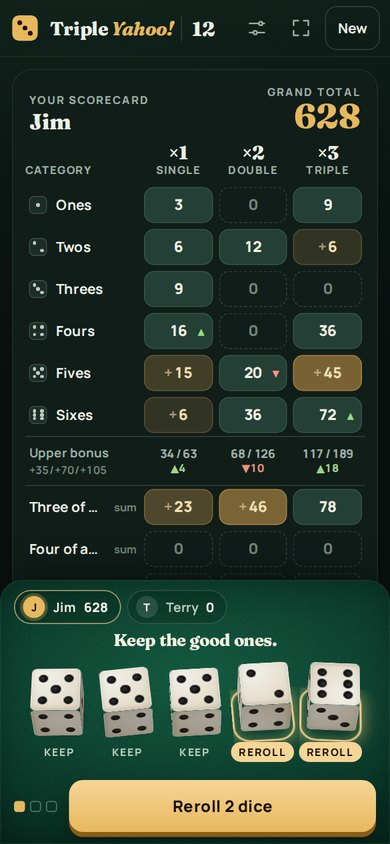

# Triple Yahoo!

**A modern browser remake of Dan Puraty's 1993 Windows shareware dice game.** Roll five dice, fill 39 boxes across three scoring columns, and chase the triple bonus. It plays on phones, tablets, laptops and desktops, needs no install beyond Node.js, and runs entirely on your own machine.



## Overview

Triple Yahoo! takes the classic five-dice game and triples it. Every category on the scorecard appears three times, in a **Single (×1)**, **Double (×2)** and **Triple (×3)** column. You choose where each roll goes, so the real game is deciding when a good roll deserves the ×3 box and when to settle for ×1.

**What you get**

- **1 to 4 players** taking turns on one device, with a "pass the dice" pause between turns
- **Real 3D dice** that are scooped up, shaken, thrown, bounce and settle, built in pure CSS with no libraries
- **Synthesized sound**: dice rattle, felt-and-wood bounces, die-on-die clacks and scoring cues, all generated live (no audio files)
- **Score hints**: after each roll, every box you could fill glows gold (brighter means more points) and boxes that would score zero get a dashed outline
- **Bonus pace tracking**: ▲ and ▼ arrows show whether each upper-section box beat or missed "three of that number", with a running total per column
- **Dark theme by default**, with a light theme one tap away
- **Full screen mode** with an obvious Exit button
- **Automatic saving**: close the tab mid-game and pick up where you left off
- **Local top ten** high-score table
- **Works offline** and keeps everything in your browser: no accounts, no servers, no tracking

| Desktop and tablet | Phone |
| --- | --- |
| Dice table and full scorecard side by side, no scrolling | Scorecard scrolls, dice tray stays docked at your thumb |
|  |  |

## How to play: quick reference

**Goal:** finish with the highest grand total after every player fills all 39 boxes (13 categories × 3 columns).

**On your turn**

1. **Roll** all five dice.
2. **Tap any dice you want to throw again** (they show REROLL), then roll again. You get up to **3 rolls** per turn.
3. **Score** by tapping one empty box on your scorecard. You can score after any roll, and you must score after the third.
4. The box's points are multiplied by its column: **×1, ×2 or ×3**. If a roll fits nothing, you have to take a zero somewhere (the game asks you to confirm).

**Scoring** (base points, before the column multiplier)

| Category | Needs | Scores |
| --- | --- | --- |
| Ones through Sixes | Any roll | Sum of the dice showing that number |
| Three of a kind | At least 3 matching dice | Sum of all five dice |
| Four of a kind | At least 4 matching dice | Sum of all five dice |
| Full house | Exactly a pair plus a triple | 25 |
| Small straight | 4 in a row (1-2-3-4, 2-3-4-5 or 3-4-5-6) | 30 |
| Large straight | 5 in a row (1-2-3-4-5 or 2-3-4-5-6) | 40 |
| Yahoo! | All five dice the same | 50 |
| Pot luck | Any roll | Sum of all five dice |

**Upper bonus:** score 63 or more base points in Ones through Sixes within a column to earn a bonus in that column.

| Column | Upper points needed | Bonus |
| --- | --- | --- |
| Single ×1 | 63 | +35 |
| Double ×2 | 126 | +70 |
| Triple ×3 | 189 | +105 |

**Reading the scorecard**

- **Gold box:** what this roll would score there. Brighter gold means more points.
- **Dashed box:** this roll would score zero there.
- **Green box:** already filled.
- **▲ / ▼ on Ones to Sixes:** you beat or missed three of that number. Three of every number is exactly 63, so staying at or above that pace earns the bonus. The Upper bonus row shows each column's running total, for example `48 / 189 ▲6`.

**Controls**

| Key or button | Action |
| --- | --- |
| **R** | Roll |
| **1** to **5** | Mark or unmark a die for reroll |
| **F**, or the corner-arrows button | Enter or leave full screen |
| **Esc**, or the gold **Exit full screen** button | Leave full screen |
| **Tab** | Move between score boxes (Enter to score) |
| **?** button | Full rules in the game |

## Getting started

You need [Node.js](https://nodejs.org) (any current LTS version). There is nothing else to install and no build step.

**Windows:** double-click **`Start Game.cmd`**. It starts the game and opens it in your browser. Keep its console window open while you play.

**Any system:**

```bash
git clone https://github.com/jimerb/Triple-Yahoo.git
cd Triple-Yahoo
node server.mjs
```

Then open <http://127.0.0.1:4317>.

**Play on a phone or tablet on your home Wi-Fi:** start the server so other devices can reach it, then open `http://<your computer's IP address>:4317` on the device.

```bash
HOST=0.0.0.0 node server.mjs            # macOS / Linux
$env:HOST='0.0.0.0'; node server.mjs    # Windows PowerShell
```

The game is plain static files, so any web server works too. `server.mjs` is a tiny built-in option that only serves the game's own files.

## Settings

Open Settings (the sliders icon) to switch **sound**, **dice animation**, **score hints** and the **light theme** on or off. Choices are remembered in your browser. The game also respects your device's reduced-motion setting.

On iPhone, Safari doesn't support full screen for web pages, so the full-screen button is hidden there. The phone's silent switch also mutes game sound.

## Rules notes

The rules come from `MANUAL.WRI` in the [original TYH20F.ZIP release](https://dose.0wnz.at/Shareware/Pegasus-3.0/W_GAMES2/TYH20F.ZIP). Where the manual is silent, this version makes these calls:

- Full house needs exactly a pair and a triple. Five of a kind does not count.
- Three and four of a kind mean *at least* that many matching dice.
- A small straight can include a duplicate die, as long as four different consecutive values are present.
- There is no extra bonus for a second Yahoo! and no joker rule.
- Ties stay tied. All tied winners go into the top ten, and only winning scores are recorded there.

## Project structure

| File | Purpose |
| --- | --- |
| `index.html` | Page structure |
| `style.css` | Layout for every screen size, dark and light themes |
| `app.mjs` | Game screen, saving, settings, full screen, top ten |
| `engine.mjs` | Pure scoring and turn rules (no browser code) |
| `dice3d.mjs` | 3D dice tray and throw animation |
| `audio.mjs` | Synthesized sound effects |
| `server.mjs` | Minimal local web server with a fixed file allowlist |
| `tests.mjs` | Rule tests |
| `Start Game.cmd` | Windows one-click launcher |
| `docs/` | README screenshots |

## Tests

```bash
node --test tests.mjs
```

The tests cover every scoring category and its edge cases, bonus thresholds for all three columns, roll and turn limits, and complete games for one to four players.

## Contributing

Bug reports and ideas are welcome in [Issues](https://github.com/jimerb/Triple-Yahoo/issues). Pull requests are limited to approved collaborators. See [CONTRIBUTING.md](CONTRIBUTING.md) for how to become one.

## Credits

Triple Yahoo! was created by **Dan Puraty** and released as Windows shareware in 1993. This project is an independent, from-scratch reinterpretation made out of affection for the original. It contains none of the original program's code or artwork.

Fonts: [Fraunces](https://fonts.google.com/specimen/Fraunces) and [Manrope](https://fonts.google.com/specimen/Manrope) from Google Fonts. The game falls back to system fonts when offline.
